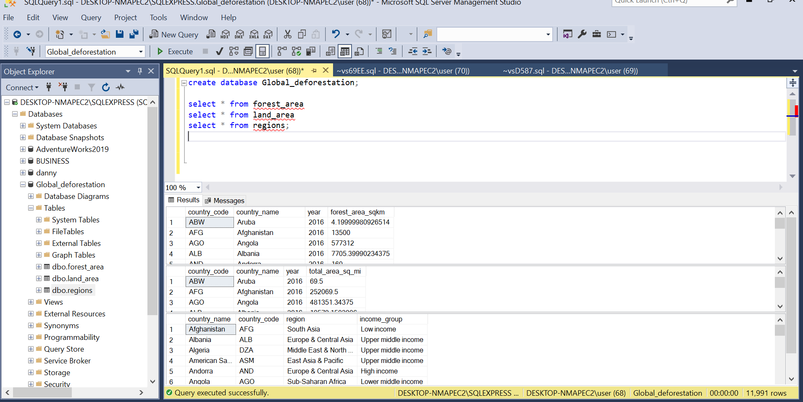
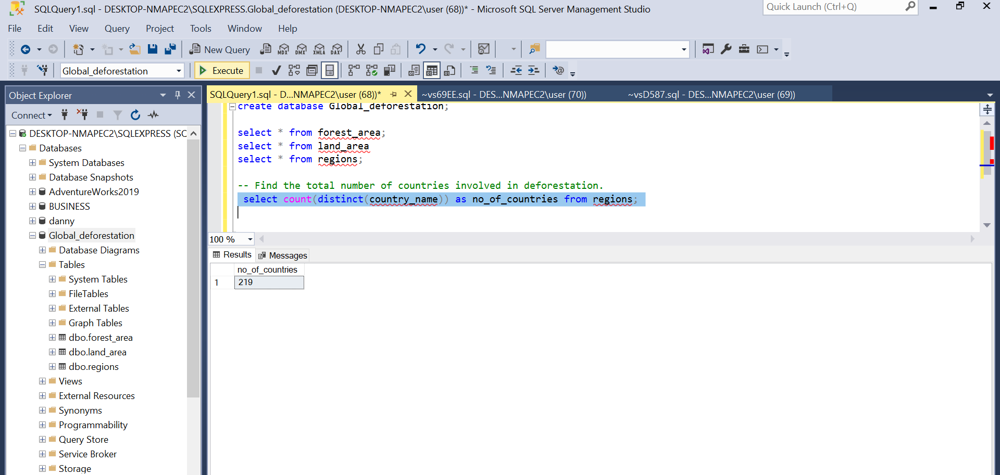
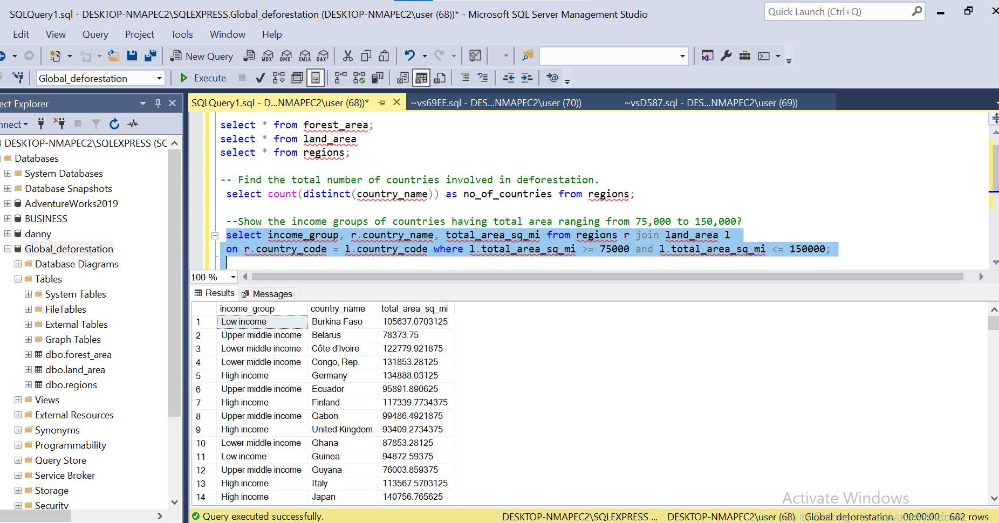
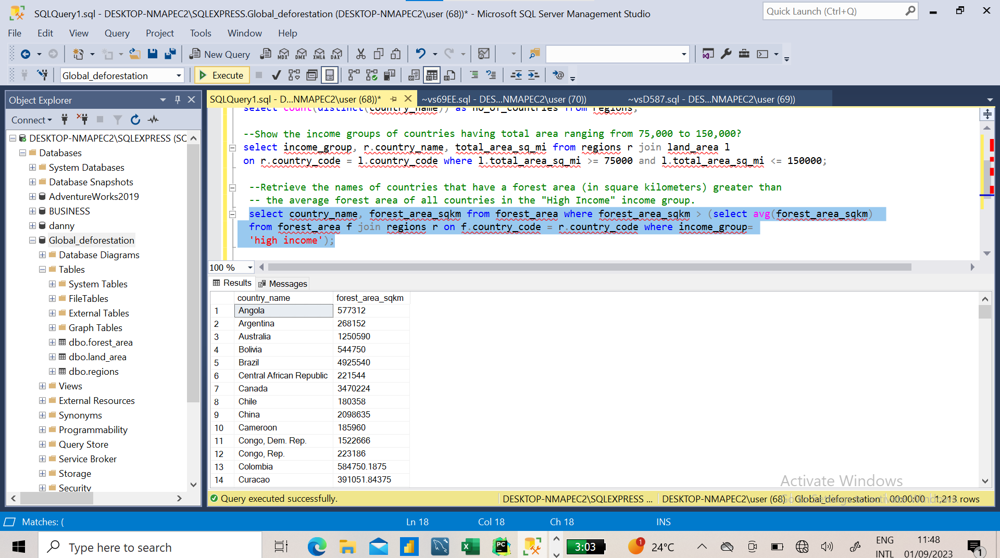
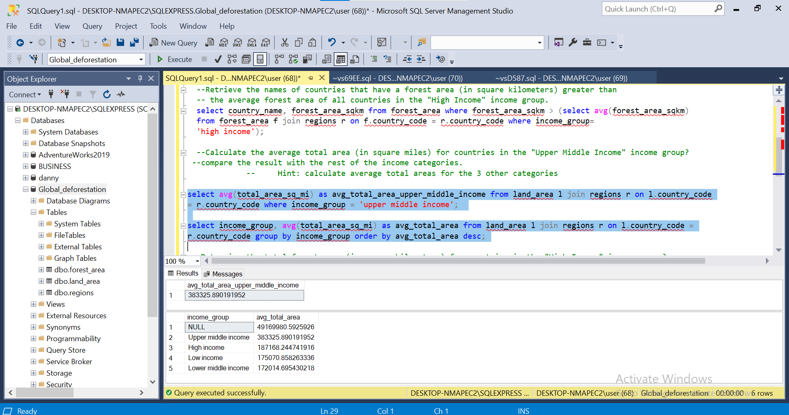
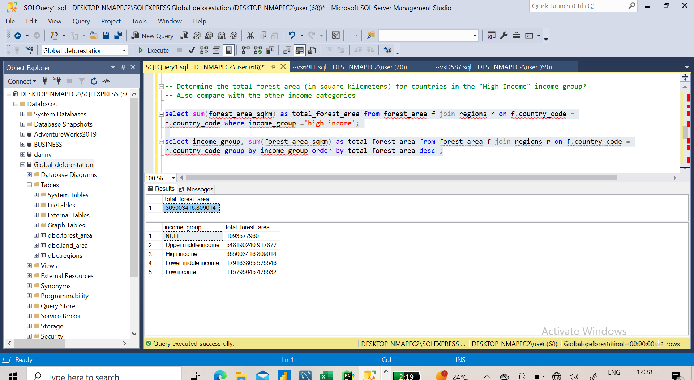
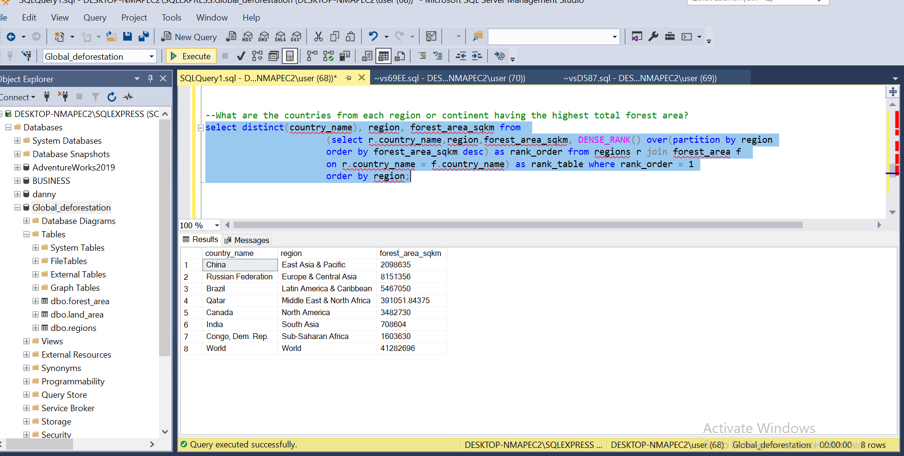

# DEFORESTATION-DATA-SQL

Deforestation is the removal of a forest or stand of trees from land that is then converted to non-forest use. Deforestation can involve the conversion of forest land to farms,ranches or urban use. The most concerntrated deforestation occurs in tropical rainforests. About 31% of Earth's land surface is covered by forest at present.
This is one-third less than the forest cover before the expansion of agriculture, with half of that loss occuring in the last century. Between 15 to 18 million hectares of forest, an area the size of Bangladesh, are destroyed every year, On average 2400 trees are cut down each minute.

## Data Cleaning 
   The dataset provided was very dirty and disorganized, so i moved it into power-query for data cleansing.
   i replaced some of the empty cells with the average of the column which is 457096.3525 ( the total_area_sq_mi column from the *LAND_AREA* dataset) and the forest_area_sqkm column from the *FOREST_AREA* data with the average of the column which is 391051.8409.
   
   the three dataset provided are
   * Forest_area
   * Land_area
   * Regions.

     

     after cleaning and transforming them on power query, i created a database and now imported them into SQL SERVER
     
     
     
### QUESTIONS TO ANSWER
---
1. Find the total number of countries involved in deforestation.
2.  Show the income groups of countries having total area ranging from 75,000 to 150,000?
3.  Retrieve the names of countries that have a forest area (in square kilometers) greater than the average forest 
    area of all countries in the "High Income" income group.
4.  Calculate the average total area (in square miles) for countries in the "Upper Middle Income" income group? 
   compare the result with the rest of the income categories.
                  Hint: calculate average total areas for the 3 other categories
5. Determine the total forest area (in square kilometers) for countries in the "High Income" income group? Also 
 compare with the other income categories.     
6. What are the countries from each region or continent having the highest total forest area?? 
---
##### ANALYSIS      
1.
  
   
   
there are 219 countries involved in the deforestation

---
2.

   ---

3.     
  
   
    the subquery gives the value of the average forest area for all countries in the "HIGH INCOME"
   group which is 392991974.880886 sqkm.This value is what is fed to main query to give the list of the countries.

---

4.
   

   

  The  UPPER MIDDLE INCOME  group has the highest average total area while the "LOW MIDDLE INCOME" has the lowest.
NOTE= the null represents the UPPER INCOME group

---
5.

  The "HIGH INCOME" group has the highest total forest area while the ""LOW INCOME" has the lowest

           

  ---

  6.

  i used subquery and windows function to get the countries from each continent having the highest total forest area.
  

   
  

  I now ordered the results by region so that each continent is grouped together to show that some of the continents have more than one country because they are tied for total forest area.
